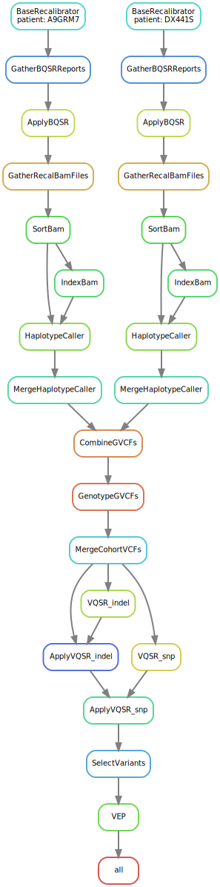

# Germline Mutation Calling
This Snakemake workflow follows the
[GATK best-practice recommandations](https://gatk.broadinstitute.org/hc/en-us/articles/360035535932-Germline-short-variant-discovery-SNPs-Indels-) 
to call small germline variants.

The pipeline requires as inputs aligned BAM files (e.g. with [BWA](http://bio-bwa.sourceforge.net/bwa.shtml)) 
where the duplicates are already marked (e.g. with [Picard](https://gatk.broadinstitute.org/hc/en-us/articles/360037052812-MarkDuplicates-Picard-)
or [sambamba](https://lomereiter.github.io/sambamba/docs/sambamba-markdup.html)).
It then performed [Base Quality Score Recalibration](https://gatk.broadinstitute.org/hc/en-us/articles/360035890531-Base-Quality-Score-Recalibration-BQSR-) 
and [joint genotyping of multiple samples](https://gatk.broadinstitute.org/hc/en-us/articles/360035535932-Germline-short-variant-discovery-SNPs-Indels-),
which is automatically parallized over user defined intervals (for examples see [intervals.txt](inputs/WGS-interval-files-excluding-supercontigs/intervals.txt)) and chromosomes. 

Filtering is performed using GATKs state-of-the-art [Variant Quality Score Recalibration](https://gatk.broadinstitute.org/hc/en-us/articles/360035531112--How-to-Filter-variants-either-with-VQSR-or-by-hard-filtering)
 
At the end of the worklow, the [Variant Effect Predictor](https://www.ensembl.org/info/docs/tools/vep/index.html) is used to annotate the identified germline mutations.
 

A high level overview of the performed steps can be seen below: 



As seen by the execution graph, an arbitrary number of samples/BAM files 
can be processed in parallel up to the joint variant calling.

## Installation 
Required tools:
- [GATK4](https://github.com/broadinstitute/gatk/) 
- [samtools](http://www.htslib.org/download/) 
- [bcftools](http://www.htslib.org/download/) 
- [sambamba](https://lomereiter.github.io/sambamba/index.html)
- [vep](https://m.ensembl.org/info/docs/tools/vep/script/vep_download.html)
- [snakemake](https://snakemake.readthedocs.io/en/stable/) 

The majority of the listed tools can be quite easily installed with [conda](https://docs.conda.io/en/latest/) which is recommanded. 

## Usage
First, modify the [config_wgs.yaml](config/config_wgs.yaml) and [resources.yaml](config/resources.yaml) files.
Both files contain detailed description what is expected. The [config_wgs.yaml](config/config_wgs.yaml) also contains 
links to some reference resources. Be careful, they are all specific for the GRCh37/hg19/b37 genome assembly. 

After setting up all the config files and installing all tools, you can simply run: 
```bash
snakemake --latency-wait 300 -j 5 --cluster "sbatch --mem={resources.mem_mb} --time {resources.runtime_min} --cpus-per-task {threads} --job-name={rule}.%j --output snakemake_cluster_submit/{rule}.%j.out --mail-type=FAIL"
```
This assumes that the cluster you are using is running [SLURM](https://slurm.schedmd.com/documentation.html).
If this is not the case, you have to adjust the command after `--cluster`. The log information of each job will be safed in the `snakemake_cluster_submit` folder.
This folder will **not** be created automatically.

`-j` specifies the number of jobs/rules should be submitted in parallel.

## Output
Below is the output of the `tree` command, after the workflow has finished for one patient H005-00ML. 
Usually you would include many patients simultaneously (>50). This is just to illustrate the created output files. 
```bash
.
├── cohort
│ ├── benchmark
│ │ ├── ApplyVQSR_indel.txt
│ │ ├── ApplyVQSR_snp.txt
│ │ ├── CombineGVCFs.txt
│ │ ├── GenotypeGVCFs.txt
│ │ ├── MergeCohortVCFs.txt
│ │ ├── SelectVariants.txt
│ │ ├── VEP.txt
│ │ ├── VQSR_indel.txt
│ │ └── VQSR_snp.txt
│ ├── cohort.recalibrated.pass.vep.vcf.gz
│ ├── cohort.recalibrated.pass.vep.vcf.gz_summary.html
│ ├── cohort.recalibrated.vcf.gz
│ ├── cohort.recalibrated.vcf.gz.tbi
│ └── logs
│     ├── ApplyVQSR_indel.out
│     ├── ApplyVQSR_snp.out
│     ├── CombineGVCFs
│     ├── CombineGVCFs.1.out
│     ├── CombineGVCFs.2.out
│     ├── ...
│     ├── ...
│     ├── CombineGVCFs.Y.out
│     ├── GenotypeGVCFs.1.out
│     ├── GenotypeGVCFs.2.out
│     ├── ...
│     ├── ...
│     ├── GenotypeGVCFs.Y.out
│     ├── MakeSitesOnly.out
│     ├── MergeCohortVCFs.out
│     ├── SelectVariants.err
│     ├── VEP.out
│     ├── VQSR_indel.out
│     └── VQSR_snp.out
├── config
│ ├── config_wgs.yaml
│ └── resources.yaml
├── H005-00ML
│ ├── benchmark
│ │ ├── ApplyBQSR.txt
│ │ ├── BaseRecalibrator.txt
│ │ ├── GatherBQSRReports.txt
│ │ ├── GatherRecalBamFiles.txt
│ │ ├── HaplotypeCaller.txt
│ │ ├── IndexBam.txt
│ │ ├── MergeHaplotypeCaller.txt
│ │ └── SortBam.txt
│ ├── H005-00ML.germline.merged.g.vcf.gz
│ ├── H005-00ML.germline.merged.g.vcf.gz.tbi
│ └── logs
│     ├── ApplyBQSR
│     ├── ApplyBQSR.0000-scattered.interval_list.out
│     ├── ApplyBQSR.0001-scattered.interval_list.out
│     ├── ...
│     ├── ...
│     ├── ApplyBQSR.0049-scattered.interval_list.out
│     ├── BaseRecalibrator
│     ├── BaseRecalibrator.0000-scattered.interval_list.out
│     ├── BaseRecalibrator.0001-scattered.interval_list.out
│     ├── ...
│     ├── ...
│     ├── BaseRecalibrator.0049-scattered.interval_list.out
│     ├── GatherBQSRReports.out
│     ├── GatherRecalBamFiles.out
│     ├── HaplotypeCaller
│     ├── HaplotypeCaller.0000-scattered.interval_list.out
│     ├── HaplotypeCaller.0001-scattered.interval_list.out
│     ├── ...
│     ├── ...
│     ├── HaplotypeCaller.0049-scattered.interval_list.out
│     ├── IndexBam.out
│     ├── MergeHaplotypeCaller.out
│     └── SortBam.out
├── rules
│ ├── BaseQualityScoreRecalibration.smk
│ ├── JointGenotyping.smk
│ ├── VEP.smk
│ └── VQSR.smk
├── Snakefile
├── snakemake_cluster_submit
│ ├── ApplyBQSR.24720887.out
│ ├── ApplyVQSR_snp.24777265.out
│ ├── BaseRecalibrator.24710227.out
│ ├── CombineGVCFs.24772984.out
│ ├── GatherBQSRReports.24715726.out
│ ├── GatherRecalBamFiles.24722478.out
│ ├── GenotypeGVCFs.24773026.out
│ ├── HaplotypeCaller.24769848.out
│ ├── IndexBam.24768728.out
│ ├── MergeCohortVCFs.24776018.out
│ ├── MergeHaplotypeCaller.24772183.out
│ ├── SelectVariants.24777733.out
│ ├── SortBam.24768066.out
│ ├── VEP.24777739.out
│ ├── VQSR_indel.24776035.out
│ └── VQSR_snp.24776036.out
```
For each analyzed patient, a seperate folder gets created. Along with the patient specific gvcf file, this folder contains log files for all the processing steps that 
were performed for that patient (`log` directory) as well as benchmarks for each rule, e.g. how long the step took or how much CPU/RAM was used (`benchmark` directory).

The `cohort` folder contains the multi-sample VCF file, which gets created after performing the joint variant calling. This VCF file contains genotype information about all patients.
 
